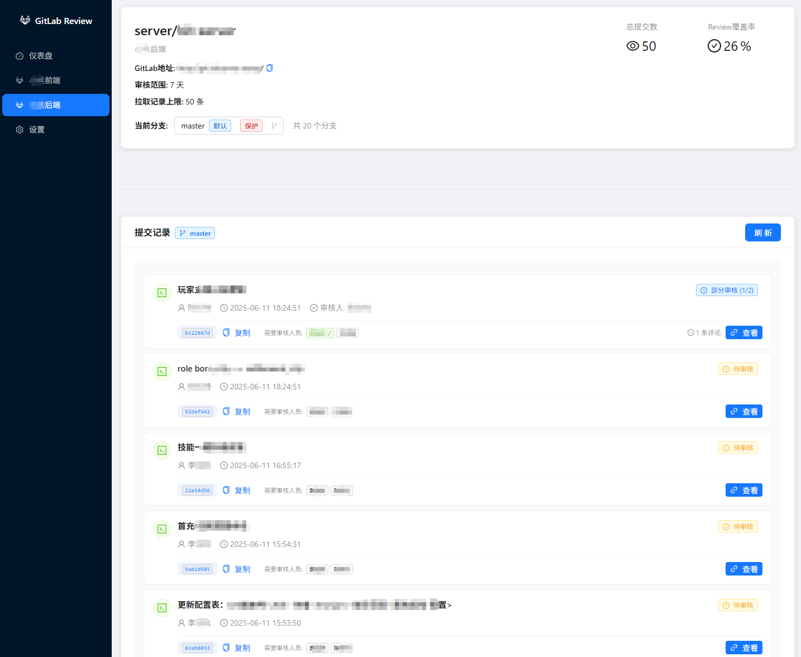

# GitLab代码Review辅助工具




重要提示：本项目完全由Cursor开发，我们只注重功能的可用性，不对代码质量做任何保证！

## 项目介绍

这是一个GitLab代码review辅助工具，帮助团队追踪和管理代码审核状态。通过集成GitLab API，自动监控提交记录和review状态，让代码审核更加透明和高效。

### 为什么要开发这个工具
- 我们期望Review代码是事后进行的，也就是不阻碍团队成员的代码提交
- 我们期望每一个commit都能被团队的每个成员review到
- 提供清晰的可视化界面，显示代码审核覆盖率和统计信息

### 基本原理
- 我们是以gitlab上的commit的评论作为是否已审核的依据
- 系统会自动检测GitLab提交记录的评论，统计审核状态

### 使用教程

#### 1. 首次登录
- 访问应用地址（默认：http://localhost:8080）
- 输入gitlab的同名账号，登录不需要密码，账号只是个标识，如果与gitlab的账号系统有匹配的账号，会自动显示该账号的昵称

#### 2. GitLab Token 准备
在配置项目之前，需要先获取项目仓库的Access Token：
1. 登录你的GitLab，进入要配置的项目仓库
2. 在项目页面点击 Settings → Access Tokens（或者Settings → Repository → Deploy tokens）
3. 创建项目级别的Access Token，必须勾选以下权限：
   - ✅ `read_api` - 读取API权限
   - ✅ `read_repository` - 读取仓库权限  
4. 设置过期时间（建议选择较长时间或永不过期）
5. 点击"Create access token"
6. **重要**：复制生成的Token（只会显示一次）

**注意**：这个Token是针对具体项目仓库的，每个项目都需要单独配置Token。

#### 3. 添加GitLab项目
1. 进入应用后，点击左侧菜单的"设置"
2. 点击"添加项目"按钮
3. 填写项目配置信息：
   - **项目名称**：Gitlab名称，如 group/project-name
   - **GitLab地址**：GitLab的地址(不包含项目)
     ```
     示例：https://gitlab.example.com/group/project-name
     项目名称填: group/project-name
     地址填: https://gitlab.example.com/
     ```
   - **Access Token**：粘贴第2步获取的Token
   - **审核范围**：显示多少天内的提交（建议7-30天）
   - **拉取记录上限**：从GitLab获取的提交数量（建议50-200条）
4. 点击"保存"

#### 4. 配置审核人员
1. 项目添加成功后，点击"刷新用户"按钮
   - 系统会自动从GitLab拉取项目成员信息
   - 等待刷新完成（可能需要几秒钟）
2. 点击项目的"编辑"按钮
3. 在"审核人员"下拉框中选择需要参与代码审核的人员
   - 可以选择多个审核人员
   - 建议选择项目的核心开发者或Tech Lead
4. 点击"保存"更新配置

#### 5. 开始代码审核
1. 刷新页面，在左侧菜单中会显示新添加的项目
2. 点击项目名称进入项目详情页
3. 选择需要审核的分支：
   - 默认显示主分支（main/master）
   - 可以切换到其他分支查看对应的提交记录
4. 查看提交列表：
   - 🟢 绿色标签：已审核
   - 🔴 红色标签：待审核  
   - 🔵 蓝色标签：部分审核
   - ⚪ 灰色标签：无需审核
5. 点击"查看提交"按钮跳转到GitLab查看具体代码修改
6. 在GitLab中添加评论完成审核：
   - 可以对整个提交添加评论
   - 也可以对具体代码行添加评论
   - 审核完成后返回本系统，状态会自动更新

#### 6. 查看审核统计
- 在项目详情页面可以看到：
  - 审核覆盖率百分比
  - 已审核/总提交数量
  - 各个提交的审核状态

#### 7. 常用操作
- **刷新数据**：点击项目详情页的刷新按钮同步最新的GitLab数据
- **切换分支**：使用分支选择器查看不同分支的提交记录
- **编辑项目**：在设置页面可以修改项目配置和审核人员
- **删除项目**：在设置页面可以删除不需要的项目

#### 8. 审核建议
- **及时审核**：尽量在提交后24小时内完成审核
- **详细反馈**：提供具体的修改建议和代码质量反馈
- **重点关注**：安全性、性能、代码规范、业务逻辑正确性
- **积极沟通**：审核中发现问题时主动与开发者沟通

#### 注意事项
⚠️ **重要提醒**：
- Token要妥善保管，不要泄露给他人
- 定期检查Token是否过期，过期后需要重新生成
- 如果GitLab项目地址发生变化，需要重新添加项目
- 审核状态基于GitLab评论，删除评论会影响审核状态显示

## 技术栈

- **前端**: React + TypeScript + Ant Design Pro
- **后端**: Node.js + Express + TypeScript
- **部署**: Docker + Nginx

## Docker 一键部署

### 方式一：使用快速部署脚本（推荐）

```bash
# 下载并运行快速部署脚本
curl -sSL https://raw.githubusercontent.com/zhandouxiaojiji/gitlab-reviewer/main/quick-deploy.sh | bash

# 或者下载仓库后运行
git clone https://github.com/zhandouxiaojiji/gitlab-reviewer.git
cd gitlab-reviewer
chmod +x quick-deploy.sh
./quick-deploy.sh
```

### 方式二：使用 Docker Hub 镜像

```bash
# 拉取最新镜像
docker pull zhandouxiaojiji/gitlab-reviewer:latest

# 运行容器
docker run -d \
  --name gitlab-reviewer \
  -p 8080:80 \
  -p 3001:3001 \
  -v $(pwd)/data:/app/server/data \
  zhandouxiaojiji/gitlab-reviewer:latest

# 访问应用
open http://localhost:8080
```

### 方式三：使用 Docker Compose

```bash
# 克隆仓库
git clone https://github.com/zhandouxiaojiji/gitlab-reviewer.git
cd gitlab-reviewer

# 启动服务
docker-compose up -d

# 查看日志
docker-compose logs -f

# 停止服务
docker-compose down
```

### 方式四：本地构建

```bash
# 克隆仓库
git clone https://github.com/zhandouxiaojiji/gitlab-reviewer.git
cd gitlab-reviewer

# 构建镜像
docker build -t gitlab-reviewer .

# 运行容器
docker run -d \
  --name gitlab-reviewer \
  -p 8080:80 \
  -p 3001:3001 \
  -v $(pwd)/data:/app/server/data \
  gitlab-reviewer
```

## 本地开发

### 环境要求
- Node.js 18+
- npm 或 yarn

### 安装依赖
```bash
# 安装所有依赖
npm run install:all
```

### 开发模式
```bash
# 同时启动前后端开发服务器
npm run dev

# 或者分别启动
npm run dev:server  # 后端开发服务器
npm run dev:client  # 前端开发服务器
```

### 构建生产版本
```bash
npm run build
```

## 使用指南

### 1. 初始登录
- 默认用户名：`admin`

### 2. 项目配置
1. 进入"设置"页面
2. 点击"添加项目"
3. 填写以下信息：
   - **项目名称**：自定义项目名称
   - **GitLab地址**：GitLab项目URL
   - **Access Token**：GitLab Personal Access Token
   - **审核人员**：选择需要参与代码审核的人员
   - **审核范围**：设置显示多少天内的提交记录
   - **拉取记录上限**：设置从GitLab拉取的提交数量上限

### 3. GitLab Token 配置
1. 登录GitLab，进入要配置的项目仓库
2. 进入 Settings → Access Tokens（或 Settings → Repository → Deploy tokens）
3. 创建项目级别的Access Token，需要以下权限：
   - `read_api`
   - `read_repository`
   - `read_user`

### 4. 查看审核状态
- 在项目详情页面查看提交记录
- 绿色标签表示已审核
- 灰色标签表示待审核
- 查看审核覆盖率统计

## 配置说明

### 数据持久化
数据存储在 `/app/server/data` 目录下：
- `projects.json` - 项目配置数据
- `users.json` - 用户数据

使用Docker时，建议将此目录挂载到宿主机：
```bash
-v $(pwd)/data:/app/server/data
```

### 端口配置
- **80** - Web界面端口
- **3001** - API服务端口

### 环境变量
- `NODE_ENV` - 运行环境（production/development）
- `PORT` - API服务端口（默认3001）

## 健康检查

访问 `http://localhost:8080/health` 查看服务状态。

## 故障排除

### 常见问题

1. **前端无法连接后端API（服务器部署）**
   - **问题**：在服务器上部署后，前端仍然尝试连接localhost:3001
   - **解决方案**：
     ```bash
     # 方案1: 使用nginx代理（推荐，默认配置）
     # 系统会自动通过nginx将/api请求代理到后端
     
     # 方案2: 如果需要直连后端，设置环境变量
     docker run -d \
       --name gitlab-reviewer \
       -p 8080:80 \
       -p 3001:3001 \
       -e REACT_APP_API_URL=http://YOUR_SERVER_IP:3001 \
       -v $(pwd)/data:/app/server/data \
       zhandouxiaojiji/gitlab-reviewer:latest
     ```

2. **GitLab连接失败**
   - 检查GitLab URL是否正确
   - 确认Access Token权限充足
   - 验证网络连接

3. **用户映射显示异常**
   - 在设置页面点击"刷新用户"按钮
   - 确认Token有用户读取权限

4. **提交记录不显示**
   - 检查审核时间范围设置
   - 确认拉取记录上限配置
   - 查看控制台错误日志

### 查看日志

```bash
# Docker容器日志
docker logs gitlab-reviewer

# Docker Compose日志
docker-compose logs -f gitlab-reviewer
```

## 贡献指南

欢迎提交Issue和Pull Request！

1. Fork项目
2. 创建功能分支
3. 提交更改
4. 发起Pull Request

## 许可证

MIT License

## 联系方式

如有问题或建议，请提交Issue或联系开发团队。 